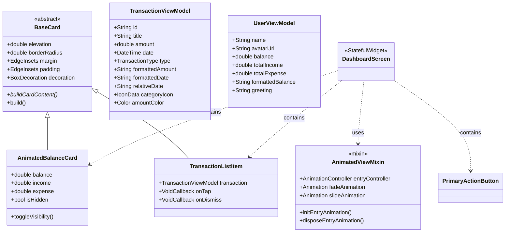

# Financial Tracker — Front-end Rewrite

Reescrita completa da camada de visualização (UI) do aplicativo Financial Tracker, com identidade visual inspirada no PicPay (verde vibrante + branco), arquitetura OOP rigorosa no Dart e componentes reutilizáveis com animações premium.

## Escopo da Mudança

> [!IMPORTANT]
> **Apenas a camada `lib/ui/` e `lib/common/theme/` serão reescritas.** Todas as camadas de domínio (`domain/`), dados (`data/`), helpers, patterns, errors e config permanecerão **intactas**. O controller existente (`HomePageController`) será preservado e reutilizado — ele já expõe Signals e Commands compatíveis.

## Direção Estética

**Inspiração: PicPay** — Interface limpa e moderna com verde vibrante como cor de destaque e superfícies brancas/off-white.

| Aspecto | Decisão |
|---|---|
| **Cor primária** | `#11C76F` (verde PicPay) |
| **Superfícies** | Branco `#FFFFFF` / Off-white `#F7F8FA` |
| **Texto primário** | Cinza escuro `#1A1A2E` |
| **Texto secundário** | Cinza médio `#6B7280` |
| **Despesa (negativo)** | Vermelho suave `#EF4444` |
| **Tipografia** | **Montserrat** (via Google Fonts package) — display/headings em 700, body em 400/500 |
| **Bordas** | `BorderRadius.circular(16)` para cards, `circular(24)` para bottom sheets |
| **Sombras** | `BoxShadow(color: black.withOpacity(0.06), blurRadius: 20, offset: Offset(0, 4))` |
| **Animações** | `AnimatedContainer`, `AnimatedOpacity`, `Hero`, scale on tap, staggered entry |

## Arquitetura OOP — Visão Geral



## Proposed Changes

### 1. Dependências — pubspec.yaml

#### [MODIFY] [pubspec.yaml](file:///c:/Users/kevin/OneDrive/Documentos/GitHub/financial_tracker/pubspec.yaml)

Adicionar o pacote `google_fonts` para usar Montserrat:

```diff
dependencies:
  auto_injector: ^2.1.1
  cupertino_icons: ^1.0.8
  faker_dart: ^0.2.2
  fl_chart: ^1.0.0
  flutter:
    sdk: flutter
+ google_fonts: ^6.2.1
  intl: ^0.20.2
  signals_flutter: ^6.0.2
  uuid: ^4.5.1
```

---

### 2. Theme System — `lib/common/theme/`

#### [MODIFY] [app_theme.dart](file:///c:/Users/kevin/OneDrive/Documentos/GitHub/financial_tracker/lib/common/theme/app_theme.dart)

Reescrever completamente com:
- Classe `AppColors` — paleta PicPay centralizada (verde, branco, cinza, vermelho)
- Classe `AppTheme` — métodos estáticos `lightTheme()` e `darkTheme()` retornando `ThemeData`
- Tipografia Montserrat via `google_fonts`
- Estilos de `ElevatedButton`, `InputDecoration`, `AppBar`, `Card`, `BottomSheet` customizados
- `ColorScheme` construído manualmente (não via `fromSeed`) para controle total

---

### 3. View Models — `lib/ui/models/`

#### [NEW] [transaction_view_model.dart](file:///c:/Users/kevin/OneDrive/Documentos/GitHub/financial_tracker/lib/ui/models/transaction_view_model.dart)

Classe wrapper sobre `TransactionEntity` com:
- `formattedAmount` → `R$ 1.234,56` (usa `Formatter`)
- `formattedDate` → `01 de janeiro de 2025`
- `relativeDate` → `Hoje`, `Ontem`, `Há 3 dias`
- `categoryIcon` → `IconData` baseado no tipo
- `amountColor` → Verde para income, vermelho para expense
- Construtor `fromEntity(TransactionEntity entity)`

#### [NEW] [user_view_model.dart](file:///c:/Users/kevin/OneDrive/Documentos/GitHub/financial_tracker/lib/ui/models/user_view_model.dart)

Classe com dados do usuário (mock):
- `name`, `avatarUrl`, `balance`, `totalIncome`, `totalExpense`
- `formattedBalance` → formatação de moeda
- `greeting` → Saudação baseada na hora do dia (`Bom dia`, `Boa tarde`, `Boa noite`)

---

### 4. Mixins — `lib/ui/mixins/`

#### [NEW] [animated_view_mixin.dart](file:///c:/Users/kevin/OneDrive/Documentos/GitHub/financial_tracker/lib/ui/mixins/animated_view_mixin.dart)

Mixin para `State<T> with TickerProviderStateMixin`:
- `AnimationController entryController` — controlador de animação de entrada
- `Animation<double> fadeAnimation` — fade in
- `Animation<Offset> slideAnimation` — slide de baixo para cima
- `initEntryAnimation()` — inicializa e dispara `forward()`
- `disposeEntryAnimation()` — limpa controlador
- Reutilizável em qualquer tela que precise de animação de entrada staggered

---

### 5. Componentes Base — `lib/ui/widgets/`

#### [NEW] [base_card.dart](file:///c:/Users/kevin/OneDrive/Documentos/GitHub/financial_tracker/lib/ui/widgets/base_card.dart)

Widget base abstrato `BaseCard` (StatelessWidget):
- Props: `elevation`, `borderRadius`, `margin`, `padding`, `decoration`
- Método abstrato `buildCardContent(BuildContext context)` → forçando subclasses a implementar
- `build()` → monta a estrutura Container + BoxDecoration + sombra + border radius + chama `buildCardContent`

#### [NEW] [animated_balance_card.dart](file:///c:/Users/kevin/OneDrive/Documentos/GitHub/financial_tracker/lib/ui/widgets/animated_balance_card.dart)

Extends conceito de BaseCard (composição via um card wrapper), StatefulWidget:
- Mostra saldo principal grande no centro (verde sobre fundo verde gradiente)
- Linha abaixo com Receita e Despesa lado a lado
- Botão olho para ocultar/mostrar saldo com `AnimatedOpacity` + `AnimatedSwitcher`
- Ícone de olho troca entre `Icons.visibility` e `Icons.visibility_off`
- `Hero` tag: `'balance-card'`
- Feedback háptico ao tocar no ícone do olho

#### [NEW] [transaction_list_item.dart](file:///c:/Users/kevin/OneDrive/Documentos/GitHub/financial_tracker/lib/ui/widgets/transaction_list_item.dart)

Extends `BaseCard` (composição):
- Recebe `TransactionViewModel` via construtor
- Leading: `CircleAvatar` com ícone de categoria em fundo verde/vermelho claro
- Title: nome da transação
- Subtitle: data relativa
- Trailing: valor formatado (verde ou vermelho)
- `Dismissible` wrap para swipe-to-delete
- `InkWell` com ripple effect
- `Hero` tag baseado no `transaction.id`

#### [NEW] [primary_action_button.dart](file:///c:/Users/kevin/OneDrive/Documentos/GitHub/financial_tracker/lib/ui/widgets/primary_action_button.dart)

Botão arredondado verde com texto branco:
- Animação de `scale` ao ser pressionado (`Transform.scale` com `GestureDetector`)
- `HapticFeedback.mediumImpact()` no tap
- Props: `label`, `icon`, `onPressed`, `isLoading`
- Estado de loading com `CircularProgressIndicator` branco

#### [NEW] [summary_pie_chart.dart](file:///c:/Users/kevin/OneDrive/Documentos/GitHub/financial_tracker/lib/ui/widgets/summary_pie_chart.dart)

Refatoração do chart existente com estilo atualizado (cores verde/vermelho da nova paleta).

#### [MODIFY] [date_filter_transactions.dart](file:///c:/Users/kevin/OneDrive/Documentos/GitHub/financial_tracker/lib/ui/widget/date_filter_transactions.dart) → mover para `lib/ui/widgets/date_filter_panel.dart`

Renomear e re-estilizar com a nova paleta, mantendo a lógica funcional.

#### [MODIFY] [transaction_sheet.dart](file:///c:/Users/kevin/OneDrive/Documentos/GitHub/financial_tracker/lib/ui/widget/transaction_sheet.dart) → mover para `lib/ui/widgets/transaction_bottom_sheet.dart`

Re-estilizar com bordas arredondadas, cores verde, e animações de entrada suaves.

#### [MODIFY] [transaction_form.dart](file:///c:/Users/kevin/OneDrive/Documentos/GitHub/financial_tracker/lib/ui/widget/transaction_form.dart) → mover para `lib/ui/widgets/transaction_form.dart`

Re-estilizar campos de input com a nova paleta e bordas arredondadas.

---

### 6. Tela Principal — `lib/ui/view/`

#### [MODIFY] [home_screen.dart](file:///c:/Users/kevin/OneDrive/Documentos/GitHub/financial_tracker/lib/ui/view/home_screen.dart) → `lib/ui/views/dashboard_screen.dart`

Reescrever como `DashboardScreen`:
- Usa `AnimatedViewMixin` para entrada animada
- `CustomScrollView` com `SliverAppBar` expansível (verde gradiente, saudação do usuário, avatar)
- `AnimatedBalanceCard` logo abaixo do AppBar
- Row com dois `PrimaryActionButton` (Receita / Despesa)
- `DateFilterPanel` (animado com `AnimatedContainer`)
- Lista de transações usando `SliverList` + `TransactionListItem`
- Dados vindos do `HomePageController` existente via Signals

---

### 7. Entry Point

#### [MODIFY] [main.dart](file:///c:/Users/kevin/OneDrive/Documentos/GitHub/financial_tracker/lib/main.dart)

- Importar novo `AppTheme` e `DashboardScreen`
- `theme: AppTheme.lightTheme()`, `darkTheme: AppTheme.darkTheme()`
- `home: const DashboardScreen()`

---

### 8. Limpeza

#### [DELETE] Arquivos antigos na pasta `lib/ui/widget/` (antiga)

Os seguintes arquivos serão substituídos pelos novos em `lib/ui/widgets/`:
- `summary_card.dart`
- `summary_carousel.dart`
- `summary_chart.dart`
- `transaction_sheets_card.dart`
- `transaction_sheet.dart`
- `transaction_form.dart`
- `date_filter_transactions.dart`

#### [DELETE] `lib/ui/view/home_screen.dart`

Substituído por `lib/ui/views/dashboard_screen.dart`.

---

## Estrutura Final de Diretórios

```
lib/ui/
├── controllers/
│   └── home_page_controller.dart     (MANTIDO - SEM ALTERAÇÃO)
├── mixins/
│   └── animated_view_mixin.dart      (NOVO)
├── models/
│   ├── transaction_view_model.dart   (NOVO)
│   └── user_view_model.dart          (NOVO)
├── views/
│   └── dashboard_screen.dart         (NOVO - substitui home_screen.dart)
└── widgets/
    ├── animated_balance_card.dart     (NOVO)
    ├── base_card.dart                (NOVO)
    ├── date_filter_panel.dart        (REFATORADO)
    ├── primary_action_button.dart    (NOVO)
    ├── summary_pie_chart.dart        (REFATORADO)
    ├── transaction_bottom_sheet.dart (REFATORADO)
    ├── transaction_form.dart         (REFATORADO)
    └── transaction_list_item.dart    (NOVO)
```

## Open Questions

> [!IMPORTANT]
> **1. Renomear pasta `controller/` para `controllers/`?**
> A pasta atual é `lib/ui/controller/` (singular). Devo renomear para `controllers/` (plural) para consistência com `views/`, `widgets/`, `models/`? Isso exigiria atualizar o import em `dependencies.dart`.

> [!IMPORTANT]
> **2. Pasta `lib/ui/widget/` antiga — deletar ou manter?**
> Após mover todos os widgets para `lib/ui/widgets/` (plural, nova estrutura), devo deletar a pasta antiga `lib/ui/widget/`? Ou você prefere manter ambas temporariamente?

> [!NOTE]
> **3. Google Fonts vs. asset local**
> O plano usa `google_fonts` package para Montserrat (download em runtime). Se preferir fonts embutidas no app (offline), posso baixar os arquivos `.ttf` e colocá-los em `assets/fonts/`. Qual abordagem prefere?

## Verification Plan

### Build & Análise Estática
```bash
flutter pub get
flutter analyze
flutter build apk --debug
```

### Teste Visual
- Executar no emulador Android e verificar:
  - DashboardScreen renderiza com SliverAppBar verde
  - AnimatedBalanceCard exibe saldo e anima ocultar/mostrar
  - TransactionListItem exibe corretamente income (verde) e expense (vermelho)
  - PrimaryActionButton tem animação de scale
  - Bottom sheet de formulário abre com estilo correto
  - Filtro de data abre/fecha com animação suave
